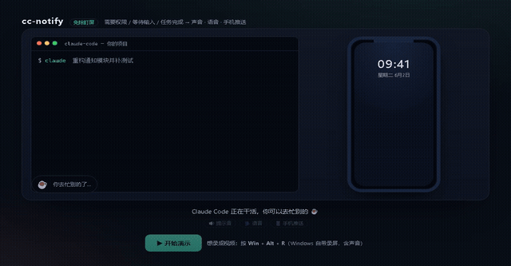

# cc-notify · Claude Code notification plugin

**English ｜ [简体中文](README.md)**

Stop watching the screen. When Claude Code **needs permission, is waiting for input, or finishes a task**, cc-notify alerts you with a **curated sound + spoken voice + (optional) music + (optional) phone push**.

- 🔔 Two clearly distinct cues: urgent (needs you) = a bright "ding-ding"; done = an ascending chime.
- 🗣️ Voice: urgent says "克劳德需要你操作" (Claude needs you), done says "任务完成了" (task finished). Both customizable.
- 📱 Phone push: Bark / PushDeer / ServerChan / WeCom / ntfy / Feishu / DingTalk / PushPlus / Telegram — pick one.
- 🪟 Cross-platform: Windows / macOS / Linux. Zero runtime dependencies (Node built-ins only).
- 😴 Effortless: sound & voice work right after install; phone push is one command, no file editing.

## Demo



> Silent GIF above; a **video with sound** is at [`demo/cc-notify-demo.mp4`](demo/cc-notify-demo.mp4). To hear the real sound + voice yourself, open [`demo/index.html`](demo/index.html) in a browser.

## Install

Run two lines inside Claude Code:

```text
/plugin marketplace add chenyunshan/cc-notify
/plugin install cc-notify@cc-notify
```

Sound and voice work **immediately** — hooks are registered automatically, no config file to edit.

## Configure phone push (optional)

To also get alerts on your phone, run:

```text
/cc-notify:setup
```

It pops up a menu asking which channel you want and to paste your key, then writes the config and sends a test notification.

## Commands

| Command | What it does |
|---|---|
| `/cc-notify:setup` | Interactive setup for sound/voice/music/phone (no file editing) |
| `/cc-notify:test` | Send two test notifications (urgent + done) so you hear both cues |
| `/cc-notify:status` | Show current switches/channel and the resolved plan (keys are not echoed) |

## Configuration

Config file: `~/.claude/cc-notify/config.json` (written by `/cc-notify:setup`; falls back to the bundled defaults when absent).

| Field | Default | Description |
|---|---|---|
| `sound` | `true` | Master switch for sound |
| `voice` | `true` | Master switch for spoken voice |
| `music_on_done` | `false` | Play music when a task finishes |
| `music_file` | `""` | Absolute path to a music file (`.wav` is most reliable) |
| `sound_urgent` | `"default"` | Urgent sound: `default` (bundled WAV) / `system` / `beep` / `off` / custom wav path |
| `sound_done` | `"default"` | Done sound: same options |
| `beep_fallback` | `false` | Hardware-buzzer fallback: also fire the PC speaker on urgent/done (see "Muted / broken sound card") |
| `visual_fallback` | `false` | Visual fallback: pop a system notification on urgent events only (visible even when muted) |
| `voice_urgent` | `"克劳德需要你操作"` | Spoken phrase for urgent |
| `voice_done` | `"任务完成了"` | Spoken phrase for done |
| `phone.provider` | `"none"` | `none`/`bark`/`pushdeer`/`serverchan`/`wecom`/`ntfy`/`feishu`/`dingtalk`/`pushplus`/`telegram` |
| `phone.bark_key` | `""` | Bark key |
| `phone.pushdeer_key` | `""` | PushDeer pushkey |
| `phone.serverchan_key` | `""` | ServerChan SendKey (delivers to personal WeChat) |
| `phone.wecom_webhook` | `""` | WeCom group-bot webhook URL |
| `phone.ntfy_server` | `"https://ntfy.sh"` | ntfy server (self-hostable) |
| `phone.ntfy_topic` | `""` | ntfy topic (your own unique string) |
| `phone.feishu_webhook` | `""` | Feishu/Lark group custom-bot webhook |
| `phone.dingtalk_webhook` | `""` | DingTalk group custom-bot webhook (if using keyword security, include "Claude") |
| `phone.pushplus_token` | `""` | PushPlus token (delivers to the WeChat official account "pushplus") |
| `phone.tg_bot_token` | `""` | Telegram Bot token |
| `phone.tg_chat_id` | `""` | Telegram chat id |

Sound playback uses a **fallback chain**: bundled WAV → system sound → programmatic beep, so there's always some sound.

### Muted / broken sound card

- **Broken / missing sound card**: the chain automatically falls through to the programmatic beep (on Windows that's the PC speaker; machines with a hardware buzzer will hear it).
- **Muted only** (device works, volume 0 / muted): the WAV "plays successfully" but you hear nothing, so local sound can't reliably reach you. In that case:
  - Enable `beep_fallback`: urgent/done also fire the PC speaker (a desktop buzzer is independent of the sound card and may sound even when muted; most laptops have no buzzer and fall back to the system sound).
  - Enable `visual_fallback`: urgent events pop a system notification / message box, visible even when muted.
  - **Most reliable**: configure **phone push** (ntfy / Bark, etc.) — fully independent of local audio; works when muted, when the card is broken, or when you're away from the computer.
- Cross-platform implementation: beep — Windows `console.beep` (PC speaker) / macOS `osascript beep` / Linux terminal bell; popup — Windows balloon toast (NotifyIcon, auto-dismiss) / macOS Notification Center / Linux `notify-send`.

## Self-check

No sound, no push — just print the resolved plan to verify the logic:

```bash
echo '{"hook_event_name":"Stop","message":"hi"}' | CC_NOTIFY_DRYRUN=1 node plugins/cc-notify/handler.js --event Stop
```

Run the unit tests:

```bash
npm test    # same as: node --test
```

## Uninstall

```text
/plugin uninstall cc-notify@cc-notify
```

Hooks are removed together with the plugin.

## How it works

The plugin registers two hooks with Claude Code: `Notification` (includes permission requests / waiting for input) and `Stop` (turn end / task done). When an event fires, `handler.js` reads the event JSON and your config, classifies it as urgent/done, then dispatches to sound, voice, optional music, and phone push. Local cues run synchronously while the phone push runs concurrently in the background, all with timeouts — it **never blocks your session**.

## License

MIT License.
